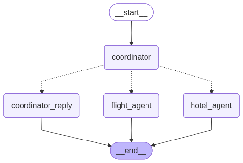

# Travel Assistant Agent

A sophisticated multi-agent travel assistant built with LangGraph, FastAPI, and OpenAI. The system intelligently handles travel-related queries, specifically focusing on flight and hotel searches, with built-in context management and request handling.

## Architecture Overview And Demo Link




### Agent Responsibilities

1. **Query Coordinator**
   - Routes user queries to appropriate specialized agents
   - Maintains conversation context
   - Handles request interruption and context switching

2. **Hotel Agent**
   - Processes hotel and accommodation related queries
   - Searches for hotels using Tavily Search API
   - Presents structured information about accommodations

3. **Flight Agent**
   - Handles flight and air travel related queries
   - Searches for flight information using Tavily Search API
   - Provides flight details and booking information

### Data Flow
1. User sends a message through the web interface
2. Message is processed by the Query Coordinator
3. Based on the query type, the appropriate agent is selected
4. The agent processes the request using external APIs
5. Response is formatted and sent back to the user
6. Conversation state is preserved for context

## Setup Instructions

### Prerequisites
- Python 3.9+
- OpenAI API key
- Tavily Search API key

### Installation

1. Clone the repository:
   ```bash
   git clone https://github.com/CoderOMaster/Travel-agent-chatbot.git
   cd travel-agent
   ```

2. Create and activate a virtual environment:
   ```bash
   python -m venv venv
   source venv/bin/activate  # On Windows: venv\Scripts\activate
   ```

3. Install dependencies:
   ```bash
   pip install -r requirements.txt
   ```

4. Create a `.env` file in the project root and add your API keys:
   ```env
   OPENAI_API_KEY=your_openai_api_key
   TAVILY_API_KEY=your_tavily_api_key
   ```

### Running the Application

1. Start the FastAPI server:
   ```bash
   uvicorn app:app --reload
   ```

2. Open your browser and navigate to:
   ```
   http://localhost:8000
   ```

## Agent Design

### Query Coordinator
- **Role**: Central router for all incoming queries
- **Capabilities**:
  - Natural language understanding
  - Intent classification
  - Context preservation
  - Request delegation

### Hotel Agent
- **Role**: Handle all accommodation-related queries
- **Capabilities**:
  - Hotel search and filtering
  - Price comparison

### Flight Agent
- **Role**: Manage flight-related queries
- **Capabilities**:
  - Flight search and comparison
  - Price tracking
  - Availability checking

### Context Management
- Session-based state management
- Automatic context preservation between messages
- Support for multi-turn conversations
- Context-aware responses

## Double-Texting Implementation

### Request Cancellation
- Each request is assigned a unique session ID
- New requests with the same session ID automatically cancel previous operations
- Asynchronous task management for clean cancellation

### Context Management Strategy
- Conversation history is maintained per session
- Context is preserved unless explicitly cleared
- Automatic cleanup of stale sessions

## Demo Instructions

### Testing Flight Search
1. Start a new chat session
2. Try queries like:
   - "Find me flights from New York to London"
   - "Show me business class options from San Francisco to Tokyo"

### Testing Hotel Search
1. Start a new chat session
2. Try queries like:
   - "Find me hotels in Manhattan"
   - "Show me beachfront resorts in Bali under $200 per night"

### Testing Request Interruption
1. Start a complex query (e.g., searching for flights)
2. Before it completes, send another query
3. The system should cancel the previous request and handle the new one

## API Endpoints

- `POST /api/chat` - Non-streaming chat endpoint
- `POST /api/chat/stream` - Streaming chat endpoint
- `GET /api/session/{session_id}` - Get chat history
- `DELETE /api/session/{session_id}` - Clear session
- `GET /health` - Health check

## Environment Variables

| Variable | Description | Required |
|----------|-------------|----------|
| `OPENAI_API_KEY` | Your OpenAI API key | Yes |
| `TAVILY_API_KEY` | Your Tavily Search API key | Yes |
| `PORT` | Port to run the server on (default: 8000) | No |

## Contributing

1. Fork the repository
2. Create a new branch (`git checkout -b feature/your-feature`)
3. Commit your changes (`git commit -am 'Add some feature'`)
4. Push to the branch (`git push origin feature/your-feature`)
5. Create a new Pull Request

